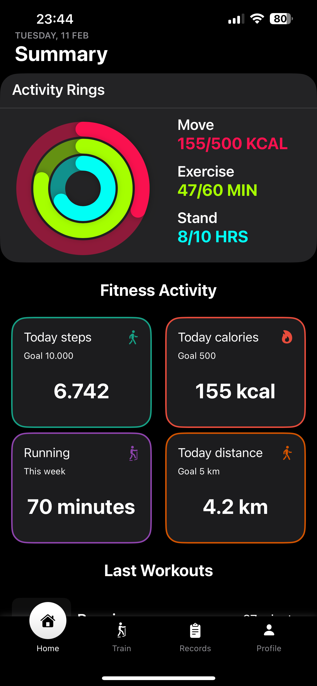
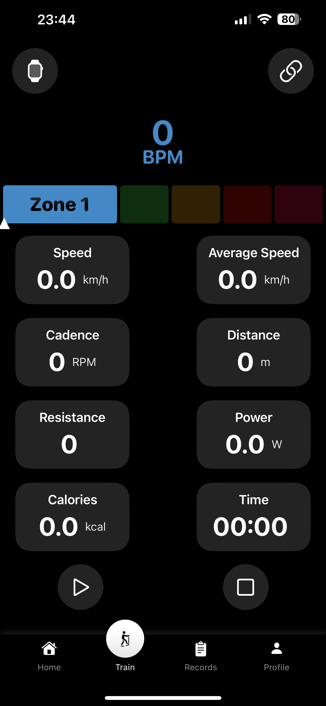

iOS app designed to connect seamlessly with your Apple Watch and a static bike, allowing you to track and register your training sessions in real time. 
The app leverages Apple’s HealthKit and Bluetooth integration to collect workout metrics, providing insights into your performance and progress.

